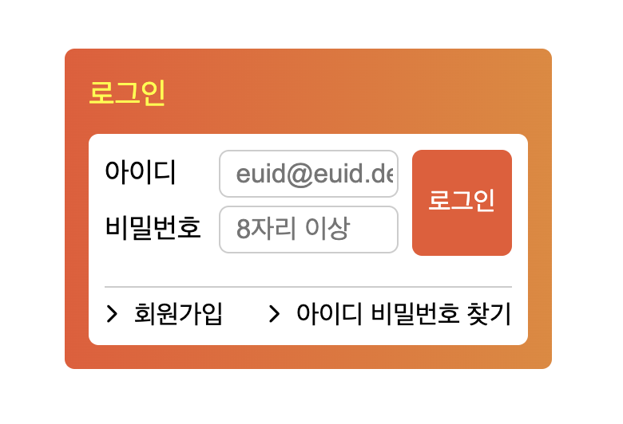
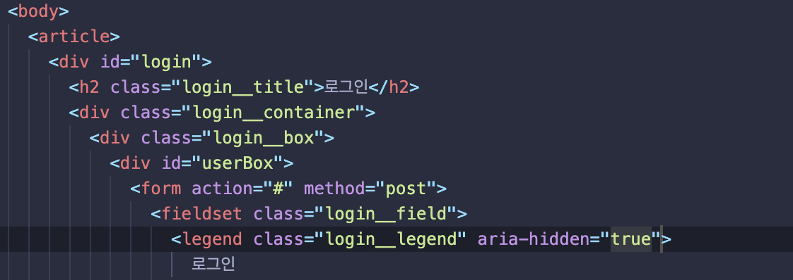
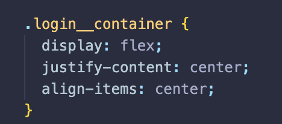
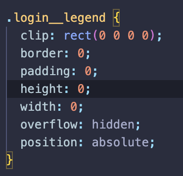

#포지션 과제 (Position assignment)

---

##과제 결과

---

##HTML과 CSS구조 설계

1. 먼저 전체적인 구조(웹카페 사이트)에서 왼쪽 로그인바를 section으로 생각하고 로그인박스를 **article**로 묶었습니다.

2. **'id=login'**이란 div로 전체로 로그인박스를 묶었습니다.

3. h2로 로그인박스 상단 '로그인'글자를 넣고, 그 아래는 div를 이용하여 컨테이너박스를 두개를 설정하였습니다. 이유는 로그인박스 안쪽 흰색영역을 **flex를 이용**하여 중앙배치하기 위해서 입니다.

4. form은 **'method=post'**를 사용하여 로그인시 서버로 보낼 수 있도록 설정하고, legend는 css를 이용해 유저가 볼 수 없도록 지우고 **'aria-hidde'**에 true속성을 사용해 스크린리더에서 인식하지 못하도록 하였습니다.

5. 로그인버튼을 **position속성**을 이용해 form의 fieldset에 relative를 부여하고 버튼은 absolute를 부여하여 안쪽에서 자리를 이동하게 하였습니다.

6. 회원가입과 아이디 비밀번호 찾기는 **float**를 사용하여 각각 float left와 right를 부여해 양끝으로 옮긴 뒤 margin을 주어 위치를 잡았습니다. (아이콘은 Font Awesome을 사용)

---

##과제하면서 느낀점

- 대략적인 HTML구조를 그리고 시작헀지만 CSS에서 막히면서 컨테이너박스를 몇번 더 추가했다.

  - 좀 더 전체적인 그림을 생각하고 결과물까지 예상해봐야겠다.

- Class명을 정하기가 너무 어려웠다. 아무래도 영단어를 잘 몰라 더욱 크게 느껴졌다.

  - 다른 사람들의 코드를 좀 더 살펴볼 필요가 있다고 느꼈다.

- CSS를 하면서 조금 어긋나면 원인과 전체적인 구조를 생각하지 않고 margin과 padding을 이용해 해결하려한 흔적이 많이 보인다.
  - 처음 HTML구조 설계단계부터 어떤식으로 코드를 짤지 잘 생각해보고 써야할 스킬도 같이 생각해보는게 좋을 것 같다.
